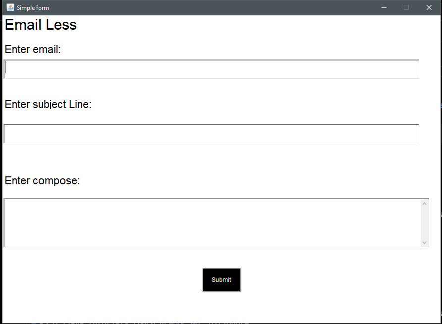

# Java Email Sender Application

## 📌 Overview
This is a simple Java application with a graphical user interface (GUI) that allows users to send emails using Gmail's SMTP server. It is built using **Java AWT** for the UI and **JavaMail API** for sending emails.

## 🛠️ Features
- GUI-based email sender
- Allows users to input recipient email, subject, and message
- Uses **JavaMail API** to send emails via **Gmail SMTP**
- Handles basic email formatting and validation

## 🚀 Installation & Setup
### 1️⃣ Prerequisites
- Java Development Kit (JDK) installed (JDK 8+ recommended)
- An active **Gmail account**
- **JavaMail API** added to your project (Download from [here](https://javaee.github.io/javamail/))

### 2️⃣ Generate an App Password (Mandatory)
Google requires App Passwords for third-party apps. To generate one:
1. Enable **2-Step Verification** on your Google Account.
2. Go to [Google App Passwords](https://myaccount.google.com/apppasswords).
3. Select **Mail** as the app and **Windows Computer** as the device.
4. Generate and copy the **16-character password**.
5. Replace `appPassword` in the code with this password.

### 3️⃣ Clone the Repository
```sh
 git clone https://github.com/yashodharchavan/email-less-java.git
 cd java-email-less
```

### 4️⃣ Run the Application
```sh
 javac -cp ".;javax.mail-1.6.2.jar;activation.jar" Main.java
 java -cp ".;javax.mail-1.6.2.jar;activation.jar" Main
```

## 📝 Configuration
Update the sender email and **App Password** in the code:
```java
final String appPassword = "your-app-password";
```

Ensure the correct **SMTP properties** are set:
```java
props.put("mail.smtp.auth", "true");
props.put("mail.smtp.starttls.enable", "true");
props.put("mail.smtp.host", "smtp.gmail.com");
props.put("mail.smtp.port", "587");
props.put("mail.smtp.ssl.protocols", "TLSv1.2");
```

## 🔧 Troubleshooting
### 🔹 Authentication Failed (`535-5.7.8 Username and Password not accepted`)
- Ensure that you are using an **App Password** instead of your Gmail password.
- Double-check that the sender email used in `PasswordAuthentication` is correct.

### 🔹 Email Not Sent
- Verify that your internet connection is active.
- Check that Gmail SMTP is not blocking connections.

## 📜 License
This project is open-source and available under the **MIT License**.

## 👨‍💻 Author
**Yashodhar**  
Feel free to contribute and enhance this project! 😊

